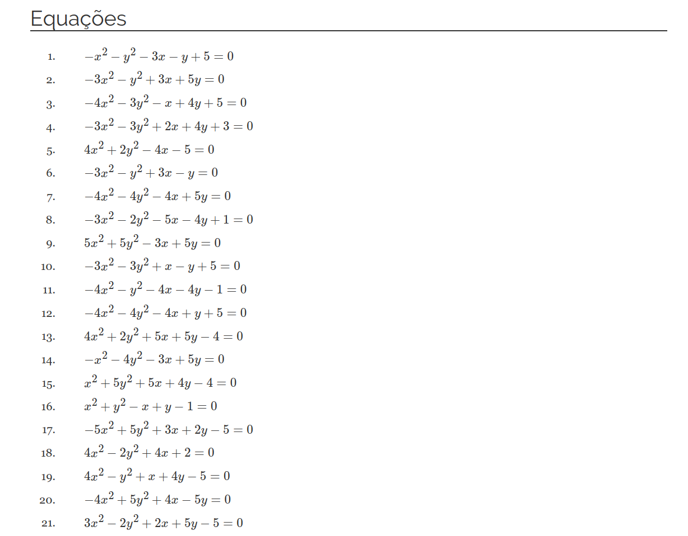

<!-- README.md is generated from README.Rmd. Please edit that file -->

```{r, include = FALSE}
knitr::opts_chunk$set(
  collapse = TRUE,
  comment = "#>",
  fig.path = "man/figures/README-",
  out.width = "100%"
)
```

# conicas

<!-- badges: start -->
<!-- badges: end -->

**conicas** é um pacote em R para gerar equações de cônicas com eixos paralelos aos eixos cartesianos, na forma geral:

$$
Ax^2 + Cy^2 + Dx + Ey + F = 0
$$

Eu o desenvolvi para me ajudar a criar listas de exercícios de Geometria Analítica.


## Instalação

Instale a versão do meu repositório no [GitHub](https://github.com/) com:

``` r
# install.packages("devtools")
devtools::install_github("fnaufel/conicas")
```

## Exemplo

```{r}
library(conicas)
```

* Para gerar um *data frame* com muitas equações:

    ```{r}
    df <- gerar_conicas_df()
    head(df)
    ```

* Use o argumento `faixas` para passar um vetor de coeficientes permitidos:

    ```{r}
    head(gerar_conicas_df(faixa = c(-1, 3, 5)))
    ```

* Para sortear, do *data frame* gerado, uma certa quantidade de cônicas, de tipos específicos:

    ```{r}
    eqs <- filtrar_conicas(
      df, 
      n = 10, 
      tipos = c('elipse' = 4, 'parábola' = 3, 'hipérbole' = 3),
      seed = 123
    )
    
    eqs
    ```

  Se quiser que as mesmas cônicas sejam sempre retornadas, por esta chamada, use um valor específico para `seed`, como acima.
  
* Para formatar a lista de equações:

    ```{r}
    gerar_lista(eqs)
    ```

  Se quiser incluir as equações em um documento RMarkdown, use a opção `results = 'asis'` no *chunk* acima.
  
* Eis um exemplo de uma lista de exercícios gerada com este pacote. Clique na imagem para visitar o site:

[](https://fnaufel.github.io/static/GA/2020.2-lista1.html)

